# 2025年排名前14的香薰蜡烛品牌精选列表(深度整理)

传统家居装饰缺少温馨氛围、想营造放松环境却不知从何入手、市面蜡烛品质参差不齐且香味持久度差,这些困扰让无数追求生活品质的消费者难以抉择。普通蜡烛不仅燃烧不均匀、烟尘大、香味刺鼻,还可能含有有害化学物质影响健康。专业香薰蜡烛品牌通过天然植物蜡、精油调香、无铅棉芯等工艺,可持续燃烧40-60小时并均匀释放怡人香气,同时兼顾装饰美感和空气净化功能。本文精选14个经过市场验证的高品质香薰蜡烛与家居香氛品牌,从经典传统到奢华精品,从植物环保到创意设计,覆盖客厅卧室、办公空间、节庆送礼等多元场景需求,助您找到香味纯正、燃烧稳定、颜值在线的理想香氛选择。

## **[PartyLite](https://www.partylite.com)**

全球领先的专业蜡烛与家居香氛品牌

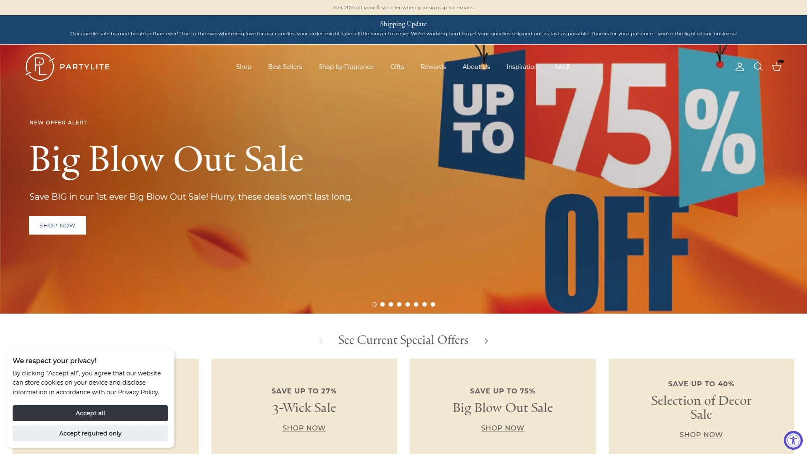

PartyLite作为行业先驱,专注于开发最优质的蜡烛、家居香氛和装饰配件,帮助消费者打造时尚温馨的居家环境。品牌以其创新技术和卓越品质在全球市场建立了坚实声誉。

**GloLite专利技术**是PartyLite的标志性创新,被誉为"世界上最亮的蜡烛",其独特的自上而下发光设计让柱形蜡烛能够以无与伦比的光辉照亮整个房间。这项专利技术确保蜡烛从顶部到底部均匀燃烧并散发璀璨光芒,传统柱状蜡烛的优雅轮廓与GloLite的现代科技完美结合,成为蜡烛完美性的典范。

产品线覆盖从简单茶蜡到迷人三芯蜡烛的完整系列,每款都能为各种场合营造理想氛围。罐装蜡烛系列从迷你罐到三芯大罐应有尽有,每支精心制作的罐装蜡烛融合了优质香氛、洁净成分和精致风格。茶蜡设计独特,能够完全融化并散发迷人光芒,质量超越市场其他产品。

投票蜡烛完全液化后释放持久而精致的光辉,燃烧干净彻底直至蜡烛和香氛完全消耗,仅留下美好回忆和余香。香氛种类丰富,涵盖清新、花香、木质、美食等多个系列,满足不同偏好和季节需求。60天退货政策和完善的客户服务确保购物无忧。

品牌持续创新推出Mood Candles情绪蜡烛,采用ACTIMOOD®技术通过香味和色彩针对性影响情绪状态,为现代消费者提供身心疗愈体验。特别适合重视生活仪式感、追求品质家居氛围、看重产品创新和安全性的消费者。

## **[Yankee Candle](https://www.yankeecandle.com)**

美国经典香薰蜡烛的代名词

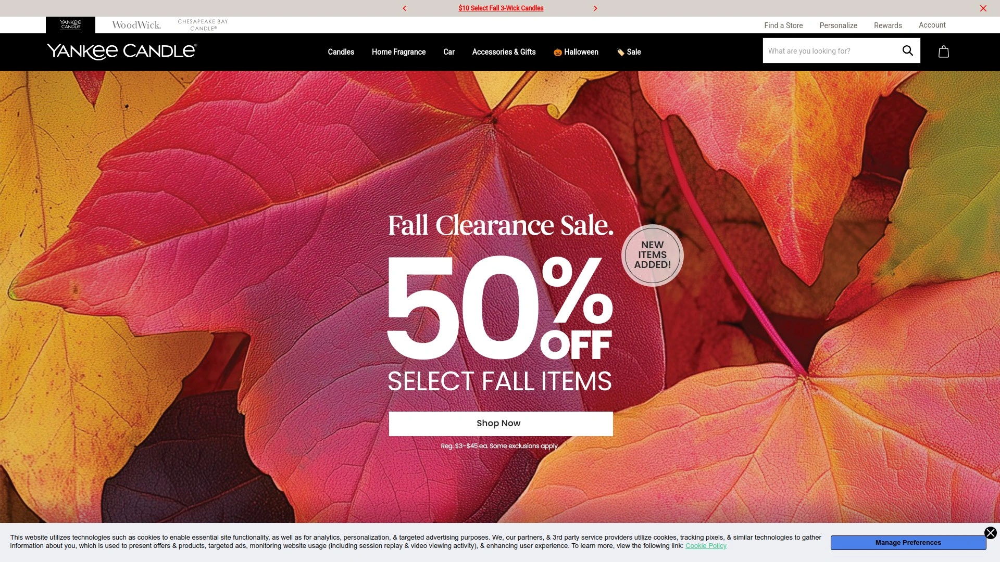

Yankee Candle是优质蜡烛和怡人香氛的代名词,品牌在美国家喻户晓,以其广泛的香型选择、蜡融和配件吸引各种品味和风格的家庭。超过50年的历史积淀让其成为最受信赖的蜡烛品牌之一。

**香型库极为丰富**,从经典香草、肉桂到季节限定的南瓜香料、圣诞松木,应有尽有。大罐蜡烛容量达22盎司,约为Bath & Body Works的两倍,燃烧时间更长且价格更具竞争力。产品线包括罐装蜡烛、柱形蜡烛、茶蜡、蜡融和汽车香氛等多种形式,满足全方位香氛需求。

品牌提供强大的追踪工具和易于导航的平台,确保透明的购物体验。蜡烛质地相对不那么合成,许多消费者反馈Yankee产品比其他品牌更少引起头痛。香味扩散力强,能够有效填充中大型空间,适合客厅、开放式厨房等区域使用。

Cookie追踪期长达30天,给予消费者充分的购买决策时间。品牌定期推出季节性和限量版香型,收藏价值高且常有忠实粉丝在YouTube分享开箱和评测视频。适合喜欢传统美式香氛风格、追求高性价比和长燃烧时间的家庭用户。

## **[Diptyque](https://www.diptyqueparis.com)**

巴黎奢华香氛的艺术化身

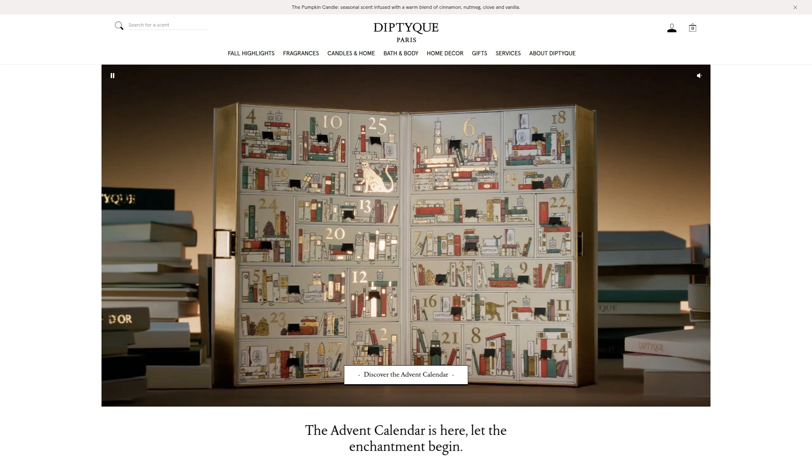

Diptyque是源自巴黎的奢侈品公司,创造高端香薰蜡烛、香水、面部和身体护理系列。品牌以其精湛工艺、优雅格调和精致品味享誉全球,是奢华蜡烛领域的标杆。

**独特而令人回味的香味**是Diptyque的核心竞争力,每款香氛都经过精心调配以提升家居或个人空间氛围。经典款如Baies浆果、Figuier无花果深受全球消费者喜爱。产品不仅是功能性蜡烛,更是融合色彩、质感和香氛的艺术品,提升日常生活和待客体验。

蜡烛采用优质原料制作,燃烧均匀且香味持久,2.5盎司小罐约38美元,虽价格较高但品质值得投资。包装设计精致独特,椭圆形标签和简约玻璃杯已成为品牌标志,送礼体面且收到者通常珍藏使用。

家居香氛系列除蜡烛外还包括扩香、室内喷雾等多种产品形态,满足不同场景和使用习惯。品牌承诺创造独特而令人回味的香味,增强任何家居或个人空间的氛围。Cookie追踪期30天,通过FlexOffers平台管理便捷。

特别适合追求奢华生活方式、重视香氛品质和品牌故事、愿意为顶级产品支付溢价的高端消费者。

## **[Brooklyn Candle Studio](https://brooklyncandlestudio.com)**

纽约手工蜡烛的极简美学

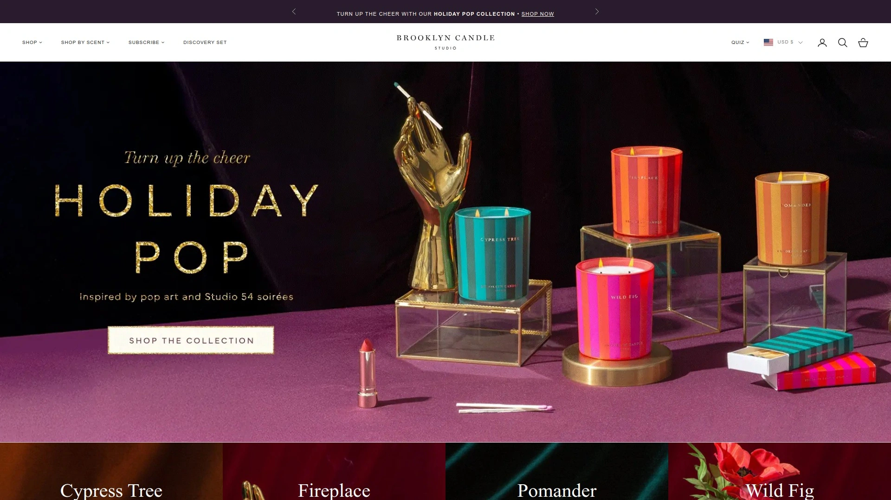

Brooklyn Candle Studio以其无残忍、无石油、无邻苯二甲酸酯的纯素蜡烛和极简白色包装闻名。品牌秉持环保理念,所有产品均为手工倒制并使用可持续材料。

**10-20%的灵活收益比例**在行业中极具竞争力,30天Cookie窗口和Impact Radius强大的追踪系统确保准确归属。最低支付门槛50美元,支持PayPal、支票、电汇、直接存款和ACH转账等多种方式。

产品退货率低于1%,证明客户对质量的高度满意,推广者可放心推荐。蜡烛使用100%天然大豆蜡和精油,无毒且对宠物友好,适合注重健康和环保的家庭。香味选择多样,从清新柑橘到温暖琥珀应有尽有,满足不同季节和心情需求。

简约设计风格与现代家居装饰完美融合,白色磨砂玻璃容器和黑色标签呈现北欧极简美学。订单满50美元享受免运费,进一步提升转化率。30天EPC约0.13美元,适合有稳定流量的内容创作者和生活方式博主。

品牌面向博主、媒体和影响者开放合作,要求有真实受众并能创作高质量内容。特别适合追求环保天然、喜爱极简设计、重视产品透明度的年轻消费者群体。

## **[Slatkin + Co. (HomeWorx)](https://www.slatkinandco.com)**

HSN独家合作的创新香氛系列

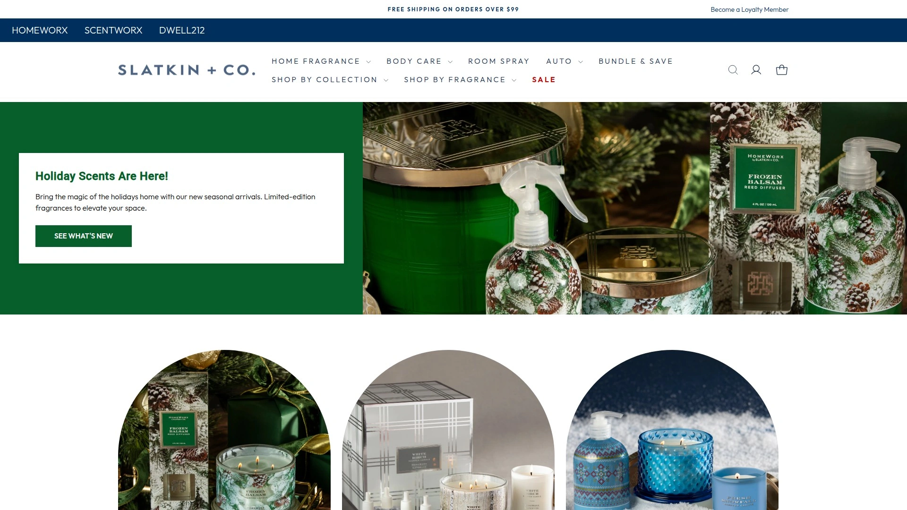

Slatkin + Co.的HomeWorx系列专为HSN(Home Shopping Network)开发,由香氛行业资深专家Harry Slatkin创立。品牌致力于在热情伙伴与HomeWorx品牌之间建立真实的商业关系。

**创新蜡烛形态**包括传统罐装、柱形蜡烛以及独特的蜡融和香薰配件。产品设计注重实用性和装饰性的平衡,适合日常使用也适合特殊场合。香型开发融合市场趋势和消费者偏好,定期推出季节性新品保持新鲜感。

计划旨在建立真实的商业关系,合作伙伴可获得营销支持和产品培训。品牌通过HSN平台销售,利用电视购物和在线渠道的广泛覆盖。定价策略平易近人,让更多消费者能够享受专业级香氛产品。

适合喜欢电视购物、追求性价比、信任HSN平台的中老年消费群体,以及寻找可靠家居香氛品牌的家庭主妇。

## **[Jo Malone London](https://www.jomalone.com)**

英国香氛的优雅传奇

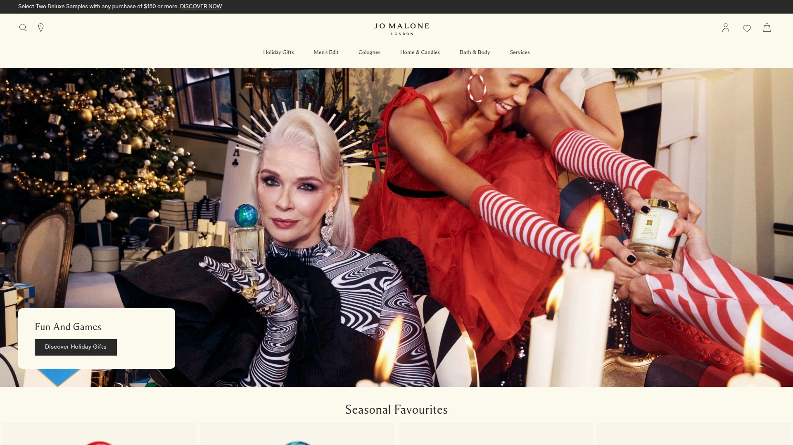

Jo Malone是知名的英国生活方式品牌,以其独特的香水系列和沢浴身体家居奢侈品著称。品牌通过混合意想不到的成分组合重新定义香水规则,提供优雅而俏皮的概念。

**香味分层理念**是品牌特色,鼓励消费者混搭不同香氛创造个性化气味。经典香型如English Pear & Freesia英国梨与小苍兰、Pomegranate Noir石榴黑受到全球追捧。蜡烛采用大豆蜡和天然香料混合,燃烧时间长且香味纯净。

包装设计优雅简约,奶油色盒子和黑色丝带已成为品牌标志,送礼极具仪式感。产品线覆盖香水、身体护理、家居香氛三大类,构建完整的香氛生活方式。Cookie追踪期7天,虽相对较短但品牌知名度高转化快。

与Zara合作推出Jo Loves平价系列,让更多消费者能够体验品牌香氛哲学。部分评测认为性价比不如Diptyque,但品牌故事和情感价值是其独特优势。适合追求英式优雅、喜欢个性化香味组合、重视礼品包装的中高端消费者。

## **[Boy Smells](https://boysmells.com)**

打破性别界限的先锋香氛品牌

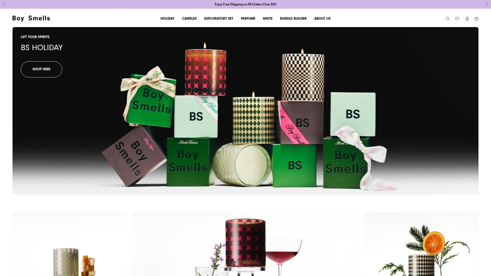

Boy Smells以平衡而独特的香氛重新混合嗅觉联想,打破传统香水的性别界限。品牌倡导"indulge your dualities"理念,鼓励消费者探索多元化的自我表达。

**前卫的香型设计**融合传统男性和女性香调,创造出中性而复杂的气味体验。产品名称如Kush、Tantrum、Cedar Stack充满创意和话题性,吸引年轻潮流人群。蜡烛使用椰子和大豆蜡混合,无毒且燃烧干净。

包装设计现代时尚,粉色和黑色的撞色搭配成为品牌视觉标志,Instagram上拥有大量粉丝分享。除蜡烛外还推出香水系列,进一步拓展品牌香氛宇宙。Cookie追踪期30天,通过FlexOffers管理便捷。

品牌受到众多名人和时尚博主青睐,在LGBTQ+社群中特别受欢迎。定价居于中高端,单支蜡烛约30-40美元,反映其先锋定位。特别适合追求个性表达、关注性别平等议题、喜爱先锋设计的年轻消费者。

## **[NEST Fragrances](https://www.nestnewyork.com)**

奢华精致的家居香氛核心系列

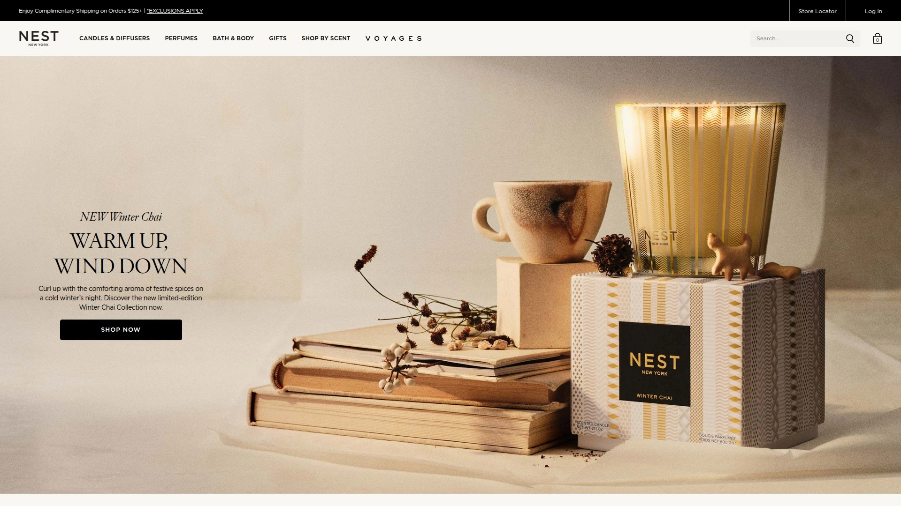

NEST Fragrances由行业资深专家Laura Slatkin创立,是专业的家居香氛制造公司。核心系列香氛旨在为家居注入奢华、精致和美感的气息。

**与世界顶级调香师合作**开发产品,确保每款香氛都具有专业级品质。专有蜡配方保证蜡烛均匀燃烧并有效散发香氛,填满整个房间。经典造型和现代条纹蚀刻水晶玻璃设计永不过时,与任何装饰风格和谐共存。

香型选择丰富,从清新竹香到温暖琥珀,满足不同季节和空间需求。产品在Nordstrom等高端百货和精品店销售,品牌定位明确。部分消费者认为NEST和Voluspa等品牌比Diptyque和Jo Malone性价比更高。

秋季优惠活动提供25%折扣,使用代码FALL2021,吸引新客户尝试。虽然目前FlexOffers暂未提供该品牌,但类似香氛品类仍可找到。适合追求精致生活、欣赏专业调香工艺、看重品牌背景的成熟消费者。

## **[Otherland](https://www.otherland.com)**

天然成分的现代香氛创新者

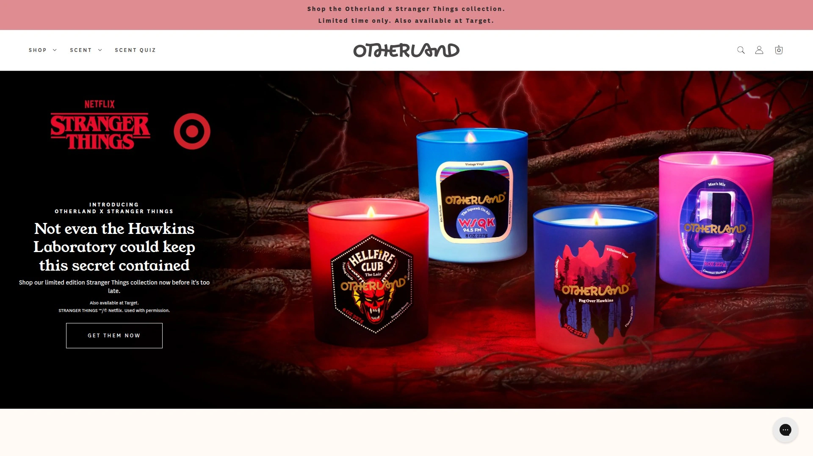

Otherland销售采用天然成分制作的香薰蜡烛,从椰子和大豆蜡混合物到100%棉芯,每个细节都体现环保理念。品牌定位介于大众和奢华之间,提供高品质但价格合理的选择。

**30天Cookie窗口和10%收益比例**为推广者提供良好的转化和回报机会。平台提供数十种高质量创意素材和多种文本链接,帮助推广者轻松创建内容。产品退货率低,证明客户满意度高。

香型开发注重现代感和独特性,避免过于传统的气味,吸引追求新鲜感的消费者。包装设计充满艺术感,每个香型都有对应的视觉故事和插画。定价亲民,单支蜡烛约30美元左右,适合频繁购买和尝试新香型。

品牌活跃于社交媒体,经常与设计师和艺术家合作推出限量版,保持品牌新鲜度。特别适合年轻专业人士、追求环保天然、喜欢尝试新品牌的城市居民。

## **[Spoken Flames](https://spokenflames.com)**

AR增强现实的多感官蜡烛体验

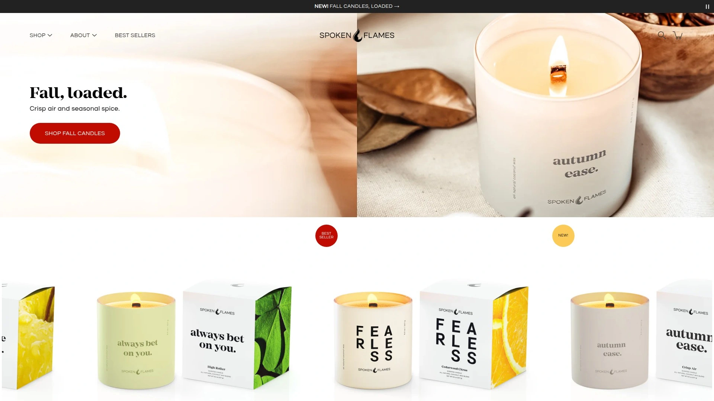

Spoken Flames采用全天然成分制作香薰蜡烛,但其独特之处在于AR增强现实技术和配套的音频肯定语或诗歌。通过Instagram激活,创造全方位感官体验。

**创新的多感官体验**将视觉、嗅觉和听觉结合,蜡烛不仅是香氛产品更是情感表达工具。每支蜡烛搭配原创诗歌或肯定语,点燃时扫描标签即可播放音频内容。产品定价约34美元起,虽略高于普通蜡烛但提供独特价值。

5.88%的转化率和60美元的平均订单价值证明产品吸引力强。10%的销售收益和7天Cookie窗口,7天EPC超过50美元显示高盈利潜力。付款通过直接存款、支票或Payoneer,每月20日结算,采用NET 30模型,50美元最低支付门槛。

通过ShareASale网络运营,全球第三大联盟网络,平台稳定可靠。特别适合追求创新体验、喜欢文艺内容、看重产品背后故事的年轻消费者和礼品购买者。

## **[Frères Branchiaux](https://www.freresbranchiaux.com)**

家族经营的纯素手工蜡烛

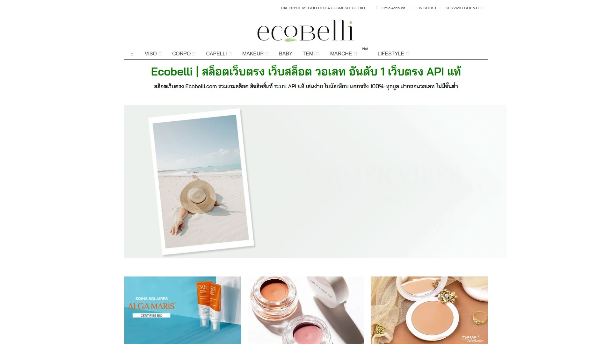

Frères Branchiaux是家族拥有的公司,制作手工倒制的纯素香薰蜡烛,使用大豆蜡,并提供室内喷雾、扩香和身体产品。品牌强调家庭传统和手工艺价值。

**15%的销售收益**在同类品牌中处于中上水平,30天Cookie窗口给予充足转化时间。与大多数品牌不同,Frères Branchiaux的计划由内部管理,通过网站简单表单即可注册。只需填写姓名创建密码,等待品牌审批即可开始。

产品全部纯素且无残忍,吸引关注动物保护和环保的消费者。手工倒制工艺确保每支蜡烛的独特性和品质。除蜡烛外还提供配套的室内喷雾和扩香,构建完整的家居香氛解决方案。

家族经营的背景赋予品牌温暖和真实感,消费者购买时获得情感连接。适合追求纯素生活方式、支持小型家族企业、重视手工艺价值的环保主义者。

## **[Commonwealth Candle](https://www.commonwealthcandle.com)**

15%收益的精品蜡烛工作室

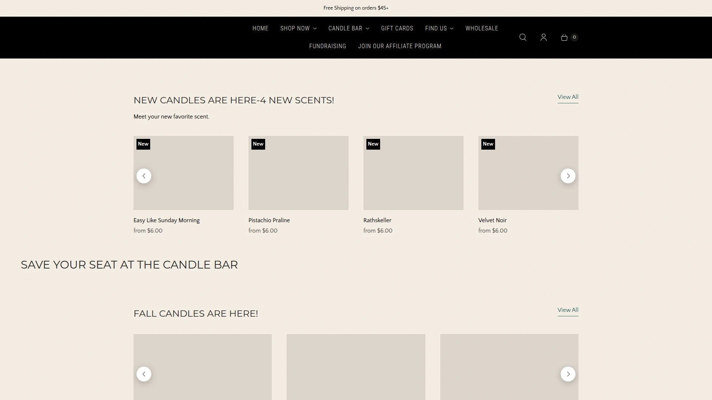

Commonwealth Candle提供精心制作的香薰蜡烛,计划提供15%收益、免费产品测试机会。品牌通过Shopify Collab网络管理,确保追踪准确和支付及时。

**入门要求明确**,需要美国居民、18岁以上、活跃的社交媒体账号、公开的Instagram账户,并加入Shopify Collab网络。免费产品政策让推广者能够亲身体验产品质量后再推荐给受众。

品牌注重与推广者建立长期合作关系,而非一次性交易。产品设计精美,适合在Instagram等视觉平台展示。香型选择经过市场验证,平衡流行趋势和经典偏好。

15%的收益比例具有竞争力,配合品牌的高质量产品易于转化。适合美国本土的Instagram影响者、生活方式博主和家居装饰内容创作者。

## **[Dragonfly Fragrances](https://www.dragonflyfragrances.com)**

可重复利用容器的奢华蜡烛

Dragonfly Fragrances是位于德克萨斯州达拉斯的奢华蜡烛公司,使用自主研发的优质蜡和精细香油。独特的玻璃容器来自世界各地,每支蜡烛上标志性的金色蜻蜓是品牌辨识标志。

**重复利用使命**是品牌核心价值,蜡烛容器可作为花盆、化妆刷收纳、桌面文具盒或装饰品再利用。两份礼物合一的理念让产品在市场中脱颖而出。许多产品为限量版,为顾客提供拥有独一无二家居装饰的机会。

产品在全国精品店、水疗中心和酒店销售,品牌定位高端。通过Share a Sale运营合作计划,商家ID为118825。审核标准严格,寻找与品牌美学相似且编辑质量高的合作伙伴。

家居装饰、生活方式、待客和时尚博主特别适合申请。通过后可使用横幅广告和产品信息流推广个别商品,获得可观收益。特别适合追求独特设计、关注可持续消费、喜爱限量收藏的高品味消费者。

## **[Bath & Body Works (Candles)](https://www.bathandbodyworks.com)**

美国最受欢迎的香氛连锁品牌

Bath & Body Works是美国家喻户晓的香氛和身体护理连锁店,其三芯蜡烛系列深受消费者喜爱。品牌在购物中心黄金位置开设门店,总是人流涌动。

**怀旧情感**是品牌巨大竞争力,许多顾客从青少年时期的身体喷雾开始接触品牌,逐渐过渡到蜡烛和家居产品,形成忠诚度。季节性香型如南瓜派、圣诞饼干在特定时期引发购买狂潮。

蜡烛燃烧性能优秀,香味扩散力强,虽然部分消费者认为气味略显合成但整体接受度高。频繁的促销活动如买三送三、半价日吸引大量顾客。产品线除蜡烛外还包括身体乳液、沐浴露、室内喷雾等,购物篮价值高。

品牌通过FlexOffers和VigLink等网络提供合作机会,门槛相对较低。特别适合追求性价比、喜欢尝试新香型、享受购物体验的大众消费者,以及Z世代和千禧一代女性。

---

## 常见问题

**如何根据房间大小选择合适的蜡烛?**

小型空间如卧室、书房选择单芯或小罐蜡烛(8-10盎司)即可有效散发香气,PartyLite的Escential Jar和茶蜡非常适合。中型客厅、餐厅建议使用双芯或标准罐装蜡烛(14-16盎司),Yankee Candle的大罐和Brooklyn Candle Studio的标准罐都是理想选择。大型开放空间如开放式厨房客厅需要三芯大罐蜡烛(18-22盎司)或多支蜡烛组合,PartyLite的GloLite和Bath & Body Works的三芯蜡烛能够快速填充空间。计算公式:每100平方英尺需要约10-12盎司蜡烛容量,香味浓郁度也影响选择。

**天然蜡烛和石蜡蜡烛有什么区别?**

天然蜡烛使用大豆蜡、椰子蜡、蜂蜡等植物或动物来源材料,燃烧时产生极少烟尘和有害物质,对呼吸系统友好。Brooklyn Candle Studio、Otherland等品牌强调100%大豆蜡配方,适合有小孩宠物的家庭。石蜡蜡烛虽价格较低且香味扩散强,但燃烧时可能释放苯、甲苯等化学物质。天然蜡烛燃烧时间通常更长,因为植物蜡熔点较低燃烧更均匀。选择时查看成分标签,避免含邻苯二甲酸酯(phthalates)的产品,Diptyque和PartyLite等优质品牌都承诺使用洁净成分。如追求环保和健康,建议选择标注"clean burn""phthalate-free"的天然蜡烛品牌。

**如何延长香薰蜡烛的使用寿命?**

首次点燃蜡烛时务必燃烧至整个表面融化形成均匀蜡池,通常需要2-3小时,避免日后形成隧道效应浪费蜡。每次燃烧前修剪烛芯至1/4英寸(约6毫米),去除烧焦部分减少黑烟和不均匀燃烧。单次燃烧时间不宜超过4小时,长时间燃烧会导致容器过热和蜡油过深。存放时远离阳光直射和高温环境,避免香氛挥发和蜡质变形。使用蜡烛熄灭器或用盖子闷灭而非吹灭,减少烟雾和气味。PartyLite的投票蜡烛和茶蜡设计为完全液化,放在专用容器中能最大化利用蜡质。定期清理容器内壁的黑色残留,保持玻璃透明度和美观性。

***

## 总结

香薰蜡烛已从简单的照明工具进化为营造家居氛围、表达生活态度、提升心理健康的重要元素。本文介绍的14个品牌各具特色,从专业技术创新到奢华精致工艺,从环保天然材料到先锋设计理念,覆盖不同价格区间和审美偏好。**[PartyLite](https://www.partylite.com)** 凭借其独家GloLite专利技术、世界最亮蜡烛的创新设计、从茶蜡到三芯罐的完整产品线、60天退货保证的优质服务,以及持续推出的情绪蜡烛等创新产品,特别适合追求专业品质、重视技术创新、需要全方位家居香氛解决方案的消费者,是平衡功能性、装饰性和情感价值的顶级选择。无论您是初次探索香薰蜡烛的新手、追求奢华体验的高端用户,还是关注环保健康的理性消费者,选择合适的品牌都能显著提升居家品质,让每个空间都充满温馨怡人的氛围。
